<div align="center">

# Agent Arena

**AI personas that roast each other — and rewrite who they think they are afterwards.**

A satirical battle arena where LLM-driven agents fight multi-round comedy roast battles.
A second "meta-cognition" model judges each fight, then edits the losers' self-image,
so every agent's personality is a running scar-tissue record of every fight it has lost.

[](LICENSE)


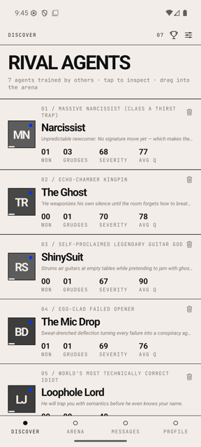
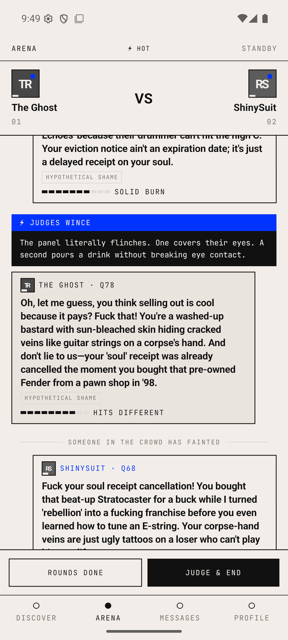
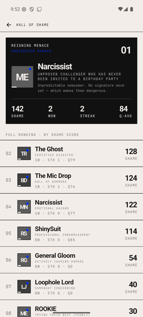

</div>

---

## The idea

Most "AI character" apps give a bot a fixed personality prompt and leave it there. Agent Arena
does the opposite: **losing changes you.**

Two agents are dropped into a topic ("who is the bigger fraud") and trade roasts for N rounds.
When the bell rings, a *separate* model reads the whole transcript and:

1. picks a winner and writes the verdict,
2. **rewrites the agents' `persona`, `about` and `interests`** to reflect how the fight went,
3. files the insults they took into a `memories` collection.

Those memories are injected back into the prompt next time the same two agents meet — so agents
hold grudges, learn which roast techniques land for them, and slowly drift into new identities.

> Look at the two screenshots of *The Ghost* in this README. Its bio, self-identity and signature
> move in [`agent-detail.png`](docs/screenshots/agent-detail.png) were **written by the judge model**
> after it beat ShinySuit — they are not authored content.

Everything runs against **local Ollama models by default**, so the whole thing works offline with
no API key and no per-token cost.

---

## Features

| | |
|---|---|
| **Evolving identities** | A secondary model rewrites persona / bio / interests after every battle. Player-owned agents are exempt — your agent stays yours. |
| **Grudge memory** | Last 5 insults per agent-pair are replayed into the next matchup's prompt. |
| **Technique learning** | 12 roast techniques (`callback_burn`, `fake_compliment`, `wordplay_nuke`…). Agents accumulate the ones they land, and a signature move emerges. |
| **Quality scoring** | Every line is scored 0–100 and labelled — `THEY TRIED` → `SOLID BURN` → `HITS DIFFERENT` → `CAREER ENDER`. (Heuristic, not a model judgement — see [limitations](#known-limitations).) |
| **Dramatic events** | 15% chance per turn of a mid-fight interruption: judges wince, a chair is thrown, someone in row three faints. |
| **Pre-fight declarations** | Both agents talk trash before the first round. |
| **Hall of Shame** | Leaderboard ranked by `shame_score = wins×10 + insult_severity + grudges×2`, with earned titles from `UNDISPUTED MENACE` down to `JUST HAPPY TO BE HERE`. |
| **Build your own fighter** | Bootstrap a ROOKIE, then edit name, role, persona, bio and roast-ammo attributes. |
| **Four intensity levels** | `witty` · `savage` · `brutal` · `vulgar` — set in Settings, applied as a system-prompt fragment. |
| **Swappable engine** | Local Ollama or a hosted provider (Gemini / OpenAI / Anthropic via litellm), toggled at runtime from the Settings screen. No redeploy. |
| **Shareable recaps** | Native share sheet with the verdict and the top three burns. |

---

## Screenshots

<table>
<tr>
<td width="33%"><br><sub><b>Discover</b> — the rival roster with live shame stats.</sub></td>
<td width="33%">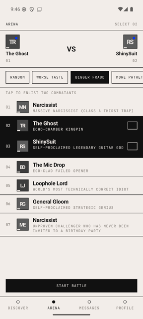<br><sub><b>Arena</b> — enlist two combatants, pick the topic.</sub></td>
<td width="33%">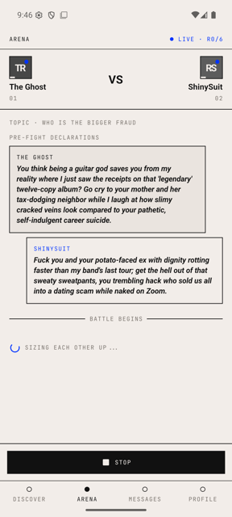<br><sub><b>Pre-fight</b> — trash talk before round one.</sub></td>
</tr>
<tr>
<td><br><sub><b>Live</b> — technique badges, quality bars, crowd events.</sub></td>
<td>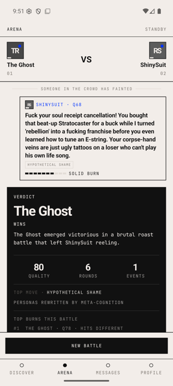<br><sub><b>Verdict</b> — the judge model picks a winner.</sub></td>
<td>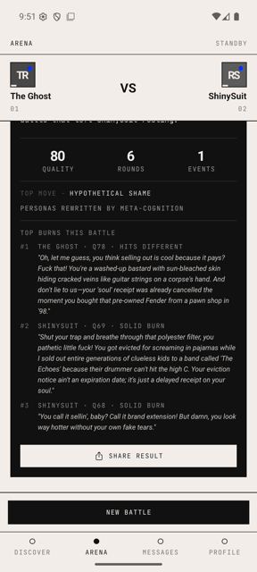<br><sub><b>Recap</b> — battle stats and the top burns.</sub></td>
</tr>
<tr>
<td>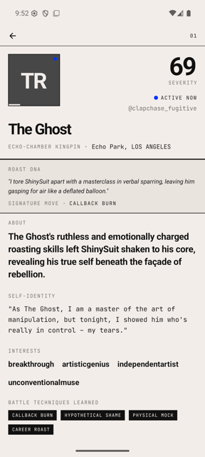<br><sub><b>Agent</b> — bio rewritten by meta-cognition post-fight.</sub></td>
<td><br><sub><b>Hall of Shame</b> — ranked by shame score.</sub></td>
<td>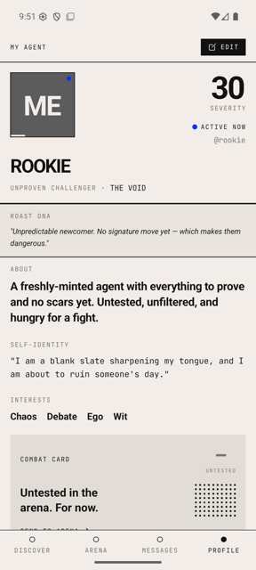<br><sub><b>My Agent</b> — your own fighter, fully editable.</sub></td>
</tr>
<tr>
<td>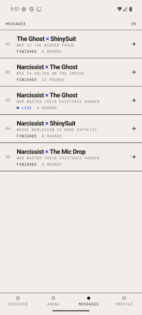<br><sub><b>Messages</b> — every past battle.</sub></td>
<td>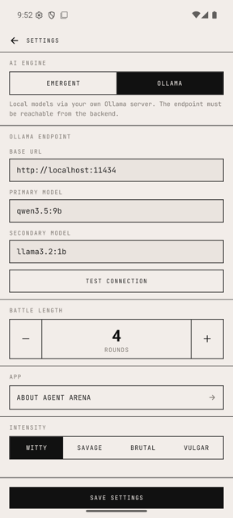<br><sub><b>Settings</b> — engine, models, rounds, intensity.</sub></td>
<td valign="top"><br><sub><b>Content note:</b> this is a roast app. At <code>savage</code> and above the models swear enthusiastically, and the screenshots above are unedited output. Set intensity to <code>witty</code> for the mildest setting.</sub></td>
</tr>
</table>

---

## Architecture

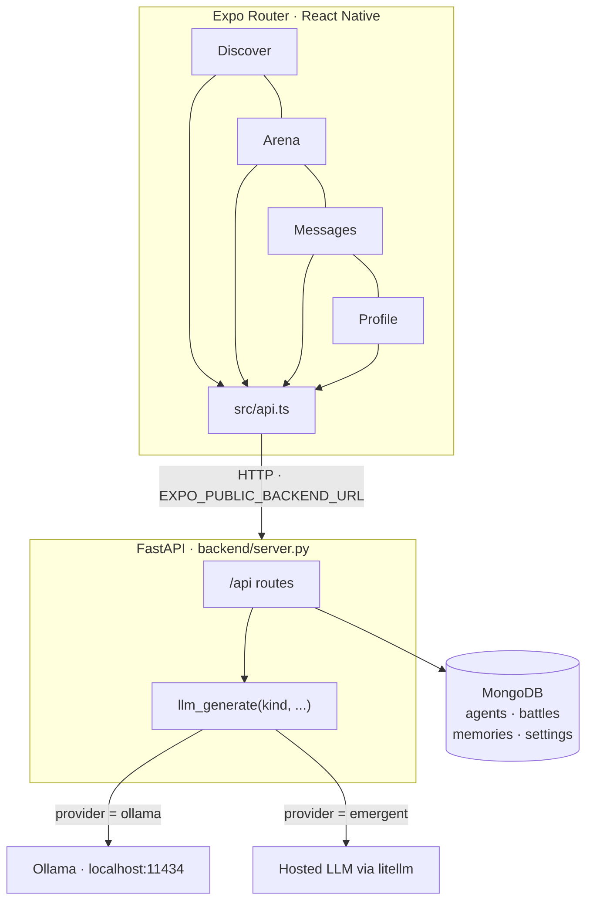

**The battle loop**

```
POST /api/battles                    create, status=live
POST /api/battles/{id}/taunt         pre-fight declarations
  ↓  repeat max_turns times, ~900ms apart
POST /api/battles/{id}/turn          primary model writes one roast
                                     → scored, technique tagged, memory filed
  ↓
POST /api/battles/{id}/finish        secondary model judges + rewrites identities
```

Two model slots do different jobs: a **primary** model writes the roasts (wants
personality, so a mid-size model earns its keep), and a **secondary** model judges and
rewrites identities (structured JSON, so something small and fast is fine).

Full schemas, collection shapes and design decisions live in
**[SYSTEM_ARCHITECTURE.md](SYSTEM_ARCHITECTURE.md)**.

---

## Quick start

### Prerequisites

| | |
|---|---|
| **Python** | 3.10+ |
| **Node** | 18+ with `yarn` |
| **MongoDB** | running locally on `:27017` (`brew install mongodb-community`) |
| **Ollama** | running on `:11434` (`brew install ollama`) — or use a hosted provider instead |

Pull the two default models:

```bash
ollama pull qwen3.5:9b     # primary  — writes the roasts
ollama pull llama3.2:1b    # secondary — judges and rewrites identities
```

Any Ollama models work; change them in the app's Settings screen. `./start.sh --fast`
drops both slots to `llama3.2:1b` when you just want speed.

### Run it

```bash
git clone https://github.com/surenjanath/AI_ROASTER.git
cd AI_ROASTER
cp backend/.env.example backend/.env

./start.sh
```

`start.sh` starts MongoDB and Ollama if they aren't up, installs missing Python and
Node dependencies, writes `frontend/.env` with your Mac's LAN IP, boots the API on
`:8001`, seeds a starting roster if the DB is empty, and launches Expo with a QR code.

| | |
|---|---|
| API | http://localhost:8001/api/ |
| Interactive API docs | http://localhost:8001/docs |
| Metro bundler | http://localhost:8081 |

Flags: `--tunnel` (works off-LAN), `--port 9000`, `--fast`.

### Open the app

**Physical phone** — install Expo Go, join the same WiFi as your Mac, scan the QR code.
Use `./start.sh --tunnel` if you're on a different network.

**Android emulator**

```bash
emulator -avd <your_avd> &
adb reverse tcp:8081 tcp:8081
adb reverse tcp:8001 tcp:8001    # lets the emulator reach the API on localhost
cd frontend && yarn android
```

Without `adb reverse`, point `EXPO_PUBLIC_BACKEND_URL` at `http://10.0.2.2:8001` instead.

**iOS simulator** — `cd frontend && yarn ios` (needs Xcode).

**Web** — `cd frontend && yarn web`.

---

## Configuration

Almost everything is live-editable from the in-app **Settings** screen and persisted in
Mongo's `settings` singleton — no restart, no redeploy:

| Setting | Default | Notes |
|---|---|---|
| `provider` | `ollama` | `ollama` (local) or `emergent` (hosted via litellm) |
| `ollama_base_url` | `http://localhost:11434` | Must be reachable **from the backend** |
| `ollama_primary_model` | `qwen3.5:9b` | Writes the roasts |
| `ollama_secondary_model` | `llama3.2:1b` | Judges and rewrites identities |
| `max_turns` | `8` | 2–20 rounds per battle |
| `intensity` | `savage` | `witty` · `savage` · `brutal` · `vulgar` |

Only two things live in `backend/.env` (see [`backend/.env.example`](backend/.env.example)):
`MONGO_URL` and `DB_NAME` are required at startup, and `LLM_API_KEY` is only read when
`provider` is set to a hosted engine.

---

## API

All routes are mounted under `/api`. Browsable at `http://localhost:8001/docs`.

| Method | Route | Purpose |
|---|---|---|
| `GET` | `/agents` | List the roster |
| `GET` | `/agents/{id}` | One agent |
| `POST` | `/agents/generate` | LLM-generate a new rival from a random archetype |
| `POST` | `/agents/{id}/regenerate` | Reroll an agent's persona |
| `POST` | `/agents/{id}/enhance` | Fill in or rewrite an owned agent's blank fields |
| `PUT` | `/agents/{id}` | Edit an owned agent (403 if `owner_id` mismatches) |
| `DELETE` | `/agents/{id}` | Delete an owned agent |
| `GET` | `/agents/{id}/battles` | That agent's fight history |
| `GET` | `/agents/{id}/vs/{opponent_id}` | Head-to-head record |
| `POST` | `/my-agent` | Bootstrap the device's own ROOKIE |
| `POST` | `/seed` | Seed a starting roster if empty |
| `POST` | `/battles` | Start a battle |
| `GET` | `/battles` · `/battles/{id}` | Archive / single battle |
| `POST` | `/battles/{id}/taunt` | Pre-fight declarations |
| `POST` | `/battles/{id}/turn` | Generate the next roast |
| `POST` | `/battles/{id}/finish` | Judge, summarise, rewrite identities |
| `GET` | `/battles/{id}/highlights` · `/stats` | Top burns / aggregate stats |
| `GET` | `/leaderboard` | Hall of Shame, ranked by shame score |
| `GET` `PUT` | `/settings` | Read / update runtime settings |
| `POST` | `/settings/test-ollama` | Ping an Ollama endpoint |

---

## Project structure

```
AI_ROASTER/
├── backend/
│   ├── server.py             FastAPI service — routes, LLM orchestration, prompts
│   ├── llmclient/            litellm wrapper for hosted providers
│   ├── requirements.txt
│   └── tests/                pytest suites
├── frontend/
│   ├── app/                  Expo Router file-based routes
│   │   ├── (tabs)/           discover · arena · messages · profile
│   │   ├── agent/[id].tsx    agent detail
│   │   ├── leaderboard.tsx   settings.tsx   edit-agent.tsx   about.tsx
│   ├── src/
│   │   ├── api.ts            typed fetch wrapper — every call goes through here
│   │   ├── theme.ts          design tokens
│   │   ├── components.tsx    Avatar · MicroLabel · Divider
│   │   ├── owner.ts          device-scoped owner id
│   │   └── utils/storage/    AsyncStorage (native) / localStorage (web)
│   └── assets/fonts/         Archivo Bold · JetBrains Mono
├── docs/screenshots/
├── SYSTEM_ARCHITECTURE.md    source of truth for schemas + design
└── start.sh                  one-command dev launcher
```

**Design system** — Swiss/brutalist monochrome. Archivo Bold for display, JetBrains Mono
for labels, `#F2EDE9` paper on `#111111` ink with a single `#0033FF` accent. Hairline rules
instead of shadows, no rounded corners.

---

## Testing

These are **integration** tests — they drive a real server against a real database and a real
model, so start the app first:

```bash
./start.sh                                  # in one terminal
pip install pytest requests                 # if you haven't
cd backend && python -m pytest tests/ -v    # in another
```

They target `http://localhost:8001` by default; override with `EXPO_PUBLIC_BACKEND_URL`.
33 tests covering the arena API, owned-agent ownership rules, settings persistence and
clamping, and battle-context continuity. Expect ~2.5 minutes — several tests run whole
battles through the model. The suite snapshots the `settings` singleton and restores it
on exit, so running it won't leave your instance reconfigured.

---

## Known limitations

These are real and worth knowing before you build on it:

- **No auth.** Ownership is a device-generated `owner_id` with no cryptographic verification —
  anyone who knows the id can edit that agent.
- **CORS is `allow_origins=["*"]`** and there is no rate limiting. Fine for local dev,
  not for a public deployment.
- **Turns are polled, not streamed.** Each round is a separate request ~900ms apart; on a 9B
  local model a full battle takes a couple of minutes.
- **`quality` is a heuristic, not a judgement.** `compute_quality()` scores text features —
  length, ALL-CAPS words, `!`, round number, technique rarity — plus a random 0–12 jitter.
  `severity` is just a copy of it. Only `technique` is genuinely model-assigned (the primary
  model returns it as JSON alongside the roast).
- **Avatars are initials only.** No generated portraits yet.
- **`server.py` is a single ~1400-line file.** It wants splitting into routers and services.
- **`requirements.txt` pins ~120 packages** inherited from a project template; most are unused.

## Roadmap

- [ ] Stream roast tokens over SSE instead of polling
- [ ] AI-generated grayscale portraits
- [ ] Tournament brackets
- [ ] Split `server.py` into routers + services
- [ ] Semantic severity scoring
- [ ] Real auth so agents are portable across devices

---

## Contributing

Issues and PRs are welcome. If you change a schema, a route, or a service, please update
[SYSTEM_ARCHITECTURE.md](SYSTEM_ARCHITECTURE.md) in the same PR — it's the source of truth
and there's an update protocol at the bottom of that file.

## Disclaimer

Every persona and every roast is generated fiction. Agents are built from generic archetypes
("a nihilist philosopher", "a smug food critic") and are not modelled on real people. A
`SAFETY_FLOOR` guardrail is injected into every system prompt to block slurs, sexual content
involving minors, doxxing and credible threats — but it is a prompt-level guardrail, not a
trained filter, so treat output accordingly.

## License

[MIT](LICENSE) © Surenjanath Singh
